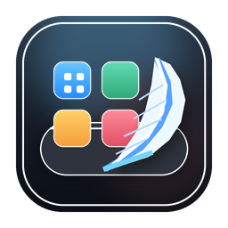
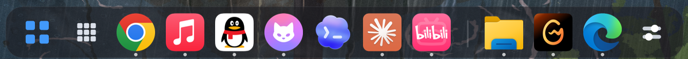
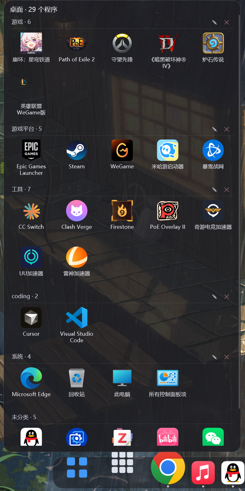
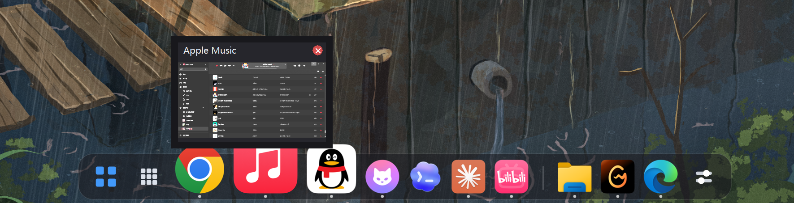
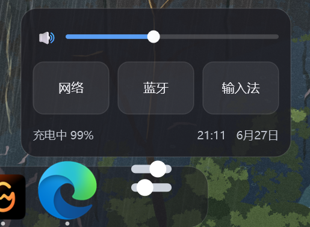

# FeatherDock

<p align="center">
  
</p>

<h3 align="center">A tiny, GPU-composited dock and app drawer for Windows.</h3>

<p align="center">
  <strong>Rust</strong> · <strong>DirectComposition</strong> · <strong>Direct2D</strong> · <strong>D3D11</strong> · <strong>Win32</strong>
</p>

<p align="center">
  
  
  
</p>

<p align="center">
  
</p>

FeatherDock 是一个 Windows 上的 Dock，用 Rust 直接写在系统原生图形栈上（DirectComposition + Direct2D + D3D11），不用 Electron 或 WebView，也没有常驻的后台扫描进程。可执行文件六百多 KB，放着不动的时候几乎不占 CPU。

常用的功能都在：图标悬停放大，正在运行的窗口按程序归组、图标下标一个小圆点，悬停能看实时缩略图。文件夹固定项可按需展开成 Stack 菜单，`Ctrl+Alt+Space` 可打开轻量命令面板。另外有一个把桌面程序分类整理的程序抽屉，和一个支持音频设备、网络、蓝牙、输入法、电量与时间的分页控制中心。

## 截图

程序抽屉把桌面上的程序按你自己分的类列出来。可以拖动图标归类，右键能固定到 Dock、移除，或新建 / 重命名分类；`此电脑`、`回收站`、`控制面板` 这些也一并收了进来：

<p align="center">
  
</p>

悬停一个正在运行的窗口，弹出它的实时缩略图：

<p align="center">
  
</p>

控制中心放了音量、网络 / 蓝牙 / 输入法，以及电量和时间：

<p align="center">
  
</p>

## Highlights

- 原生 GPU 合成：DirectComposition + Direct2D + D3D11 + DirectWrite
- Dock 动效：悬停放大、点击弹跳、自动隐藏滑入滑出、全屏/最大化时收起
- 程序抽屉：玻璃弹层从 Dock 按钮位置展开，开合动画跟随屏幕刷新率（每个 vsync 渲染），分类标题与图标逐行波浪式淡入
- 抽屉自定义：右键程序可 `固定到 Dock`、`移除该程序`、`放入分类`，也可新建/重命名/删除分类
- 系统入口：程序抽屉保留 `此电脑`、`回收站`、`控制面板`
- 低资源策略：抽屉扫描结果写入缓存，按 TTL 和桌面签名失效；没有后台文件扫描器
- 窗口体验：运行窗口按应用分组，悬停时按需创建 DWM 缩略图预览
- 文件夹 Stack：点击固定到 Dock 的文件夹时按需读取目录，并显示轻量打开菜单
- 命令面板：`Ctrl+Alt+Space` 搜索固定项、运行窗口和桌面程序
- 控制中心：主音量滑块、输出/输入音频设备选择、Wi-Fi 刷新与连接、蓝牙设备状态、输入法切换，以及电量与时钟入口
- 固定项自修复：WindowsApps 版本目录更新或唯一 exe 文件名变化后，启动时会在安全范围内修复失效路径
- 主题预设：玻璃、紧凑、纯色、macOS、高对比五种预设，不引入重型皮肤系统
- 设置窗口：系统任务栏模式、Dock 显示模式、主题预设、全屏 / 最大化时收起、开机自启、常驻应用管理
- 桌面模式：可隐藏 Windows 桌面图标，把桌面程序交给抽屉管理
- 单文件发布：`build.ps1` 产出仓库根目录的 `FeatherDock.exe`

## Build And Run

可执行文件不提交到仓库。运行构建脚本后，最终产物会收敛到仓库根目录的单个 `FeatherDock.exe`：

```powershell
.\build.ps1          # 构建 release 并生成根目录 FeatherDock.exe
.\build.ps1 -Run     # 构建后立即启动
.\build.ps1 -Clean   # 先 cargo clean，再从零构建
```

规则很简单：需要分发或日常运行时，只运行根目录的 `FeatherDock.exe`。`target\` 下的 exe 只是 cargo 构建缓存。

## Usage

Dock 常用交互：

- 悬停图标会放大，点击固定项目会启动或激活它。
- 点击运行窗口项目会激活对应窗口；同一应用的多个窗口会归为一组。
- 悬停运行窗口可显示 DWM 缩略图预览。
- 点击文件夹固定项会展开 Stack 菜单；菜单打开时才读取该目录。
- 按 `Ctrl+Alt+Space` 打开命令面板，搜索固定项、运行窗口和桌面程序。
- 左侧 Start 按钮打开 Windows 开始菜单，右侧 Control 按钮打开 FeatherDock 控制中心。
- 控制中心支持主页面与音频、网络、蓝牙、输入法、电量子页面；页面切换保留玻璃背景和短动画，网络状态刷新使用独立的短时刷新计时器。
- 音频页可切换活动设备；网络页可刷新并连接 Wi-Fi；蓝牙页和输入法页提供设备/输入法状态与系统设置入口。
- Windows 右下角通知区域里的 FeatherDock 小图标右键菜单，以及设置窗口，都可切换常驻 / 自动隐藏、任务栏显示策略、主题预设、桌面图标隐藏和抽屉按钮。

程序抽屉：

- 点击 Dock 上的应用抽屉按钮打开桌面程序列表。
- 抽屉会扫描用户桌面、OneDrive 桌面和公共桌面上的程序/快捷方式，并自动加入 `此电脑`、`回收站`、`控制面板`。
- 右键程序可打开、固定到 Dock、移除该程序或放入分类。
- 拖拽程序可调整分类位置；右键空白处可新建分类、恢复已移除项目或刷新程序列表。
- 抽屉扫描结果缓存在 `%APPDATA%\FeatherDock\drawer-cache.tsv`，正常打开不会反复遍历 Shell namespace。

添加 Dock 固定项：

- 从 Explorer 拖入应用、快捷方式、文件、文件夹或图片。
- 在 Windows 右下角 FeatherDock 小图标的右键菜单中选择 `添加文件或应用...` 或 `添加文件夹...`。
- 从程序抽屉右键程序，选择 `固定到 Dock`。

## Configuration

固定项配置：

```text
%APPDATA%\FeatherDock\featherdock.toml
```

示例：

```toml
[[item]]
label = "Chrome"
app = "chrome.exe"

[[item]]
label = "Pictures"
path = "C:\\Users\\User\\Pictures"

[[item]]
label = "Photo"
path = "C:\\Images\\photo.png"

[[item]]
label = "Tool"
path = "C:\\Tools\\tool.exe"
icon = "C:\\Tools\\tool.ico"
```

Dock 行为设置：

```text
%APPDATA%\FeatherDock\settings.toml
```

支持项包括：

- `dock_mode = "always" | "autohide"`
- `taskbar_mode = "show" | "autohide" | "hidden"`
- `hide_on_fullscreen = true | false`
- `hide_on_maximized = true | false`
- `drawer_enabled = true | false`
- `hide_desktop_icons = true | false`
- `theme = "glass" | "compact" | "solid" | "macos" | "contrast"`

程序抽屉自定义：

```text
%APPDATA%\FeatherDock\drawer.toml
```

`drawer.toml` 保存用户分类和被移除的抽屉项目；移除只影响抽屉显示，不删除真实快捷方式或应用。

固定项启动时会检查保存的路径。对于版本化 WindowsApps 路径或同目录下只有一个可执行文件的失效路径，FeatherDock 会尝试更新配置；无法安全判断时会保留原配置，避免误指向其它程序。

## Run / Quit Safely

正常退出请使用托盘菜单“退出 FeatherDock”，或从命令行请求主窗口优雅关闭：

```powershell
.\FeatherDock.exe --quit
```

如果曾经按进程名强制结束过 `FeatherDock.exe`，主进程和 watchdog 可能会被同时杀掉。此时可运行一次恢复命令，让 FeatherDock 根据 guard 文件恢复任务栏，并重新显示桌面图标：

```powershell
.\FeatherDock.exe --restore-system
```

不要用 `Stop-Process -Name FeatherDock` / `taskkill /IM FeatherDock.exe` 作为常规关闭方式；watchdog 是同一个 exe 的守护模式，按镜像名强杀会把守护进程一起结束。

## Build From Source

要求：

- Windows 10 或更新版本
- Rust stable toolchain
- `rust-toolchain.toml` 中固定的 Windows GNU target

发布构建（推荐，产出唯一的 `FeatherDock.exe`）：

```powershell
.\build.ps1            # = cargo build --release + 收敛成根目录单个 exe
.\build.ps1 -Clean     # 先 cargo clean，再从零构建
```

开发期的常用 cargo 命令：

```powershell
cargo build
cargo test
cargo build --release
```

> 注意：直接用 `cargo build` / `cargo run` 会在 `target\` 下生成临时 exe。需要最终运行或分发的 exe 时，请用 `build.ps1`。

本项目通过 `.cargo/gnu-linker.cmd` 定位 Rustup 自带的 GNU linker，并将
`windows` crate 固定在 `0.58`，以使用预构建 import libraries，避免依赖本机
`dlltool` 或 `as` 的状态。应用图标资源使用预生成的 `assets/featherdock.res.o` 链接进 Windows 可执行文件。

## Project Layout

| Path | Purpose |
| --- | --- |
| `src/main.rs` | Win32 window、DPI、消息循环、输入、托盘和全局状态 |
| `src/dock.rs` | Dock 布局、放大曲线、自动隐藏和动画 easing |
| `src/render.rs` | Direct2D 绘制圆角底座、图标、Start / Control / Drawer glyph |
| `src/graphics.rs` | D3D11、DXGI、Direct2D、DirectComposition、图标 bitmap |
| `src/apps.rs` | 内置按钮、默认应用、运行窗口和固定项合并 |
| `src/command_palette.rs` | `Ctrl+Alt+Space` 命令面板和按需入口搜索 |
| `src/folder_stack.rs` | 文件夹固定项的按需 Stack 菜单 |
| `src/theme.rs` | 轻量主题预设和渲染颜色参数 |
| `src/drawer.rs` | 程序抽屉窗口、开合动画、右键菜单、拖拽分类 |
| `src/drawer_layout.rs` | 抽屉分类布局、命中测试和 drop target 计算 |
| `src/drawer_input.rs` | 分类名称输入弹窗 |
| `src/desktop_scan.rs` | Shell 桌面枚举、系统入口、抽屉缓存和启动逻辑 |
| `src/categories.rs` | 抽屉分类、隐藏项和 `drawer.toml` 持久化 |
| `src/control_center.rs` | 分页控制中心、音频/网络/蓝牙/输入法交互和页面动画 |
| `src/sysctl.rs` | Windows 音频设备、Wi-Fi、蓝牙、输入法、电量和时间系统接口 |
| `src/settings.rs` | `settings.toml` 设置模型 |
| `src/settings_window.rs` | 原生设置窗口 |
| `src/taskbar.rs` | Windows 任务栏 show / autohide / hidden 策略 |
| `src/window_preview.rs` | DWM 窗口缩略图预览 |
| `src/windows_list.rs` | WinEvent 驱动的运行窗口分组 |
| `src/desktop_icons.rs` | Windows 桌面图标显示/隐藏 |
| `src/watchdog.rs` | 进程异常退出后的任务栏和桌面图标恢复守护 |
| `src/icons.rs` | WIC 图片缩略图、Shell 图标和 PIDL 图标提取 |
| `assets/` | 应用图标和 Windows resource 资源 |
| `docs/images/` | README 截图 |
| `build.ps1` | 唯一的发布构建脚本，产出根目录单个 `FeatherDock.exe` |

## Verification

Windows CI 会执行：

- `cargo fmt --all -- --check`
- `cargo check --all-targets`
- `cargo test`
- `cargo clippy --all-targets -- -D warnings`
- `cargo build --release`

本地重新发布可运行 `build.ps1 -Verify`，它会先执行格式、测试和 Clippy 检查，再构建并在仓库根目录
生成唯一的 `FeatherDock.exe`。`target\`、`.codex-target-*` 和其它 Cargo 输出都只是可删除的中间缓存，不是运行入口。

## License

MIT. See [LICENSE](LICENSE).
