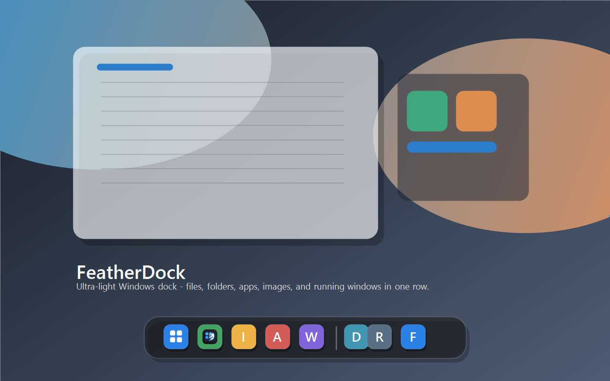

# FeatherDock

<p align="center">
  
</p>

<h3 align="center">A tiny, GPU-composited dock for Windows.</h3>

<p align="center">
  <strong>Rust</strong> · <strong>DirectComposition</strong> · <strong>Direct2D</strong> · <strong>D3D11</strong>
</p>

<p align="center">
  
  
  
</p>



FeatherDock 是一个为 Windows 打造的轻量级 Dock。它把应用、文件、文件夹、
图片和正在运行的窗口放在同一排，用 Rust + Windows 原生图形栈实现悬停放大、
点击弹跳、自动隐藏和托盘管理。

## Highlights

- 单文件发布：`release/FeatherDock.exe`
- 当前优化构建约 **380 KiB**
- DirectComposition + Direct2D + D3D11 + DirectWrite 原生 GPU 合成
- 悬停放大、点击弹跳、底部边缘唤出和自动隐藏
- 可固定应用、快捷方式、普通文件、文件夹和图片
- 图片使用一次性 WIC 缩略图，其他内容使用 Windows Shell 图标
- 右侧显示正在运行的窗口，中间用分隔线区分固定内容和运行窗口
- 托盘菜单支持添加内容、切换 Dock 模式、打开设置和退出
- 配置保存到 `%APPDATA%\FeatherDock\featherdock.toml`
- 无 Electron、无 WebView、无额外应用运行时依赖

## Download And Run

当前仓库只保留一个发布版：

```text
release/FeatherDock.exe
```

双击即可启动。FeatherDock 会显示在主屏幕底部，并以 no-activate 的方式保持在
顶层；右键托盘图标或 Dock 左侧的 Start tile 可以打开菜单。

## Usage

添加内容有两种方式：

- 从 Explorer 拖入应用、快捷方式、文件、文件夹或图片。
- 在托盘菜单中选择 `添加文件或应用...` 或 `添加文件夹...`。

常用交互：

- 悬停图标会放大。
- 点击固定项目会打开它。
- 点击运行窗口项目会激活对应窗口。
- 右键固定项目可以打开、在 Explorer 中定位或从 Dock 移除。
- 托盘菜单可以切换常驻模式和自动隐藏模式。

## Configuration

主配置文件：

```text
%APPDATA%\FeatherDock\featherdock.toml
```

示例：

```toml
[[item]]
label = "Chrome"
app = "chrome.exe"

[[item]]
label = "Pictures"
path = "C:\\Users\\User\\Pictures"

[[item]]
label = "Photo"
path = "C:\\Images\\photo.png"

[[item]]
label = "Tool"
path = "C:\\Tools\\tool.exe"
icon = "C:\\Tools\\tool.ico"
```

Dock 行为设置保存在：

```text
%APPDATA%\FeatherDock\settings.toml
```

支持常驻 / 自动隐藏、全屏应用前自动收起、以及任务栏显示策略。

## Build From Source

要求：

- Windows 10 或更新版本
- Rust stable toolchain
- `rust-toolchain.toml` 中固定的 Windows GNU target

命令：

```powershell
cargo build
cargo test
cargo build --release
```

本项目通过 `.cargo/gnu-linker.cmd` 定位 Rustup 自带的 GNU linker，并将
`windows` crate 固定在 `0.58`，以使用预构建 import libraries，避免依赖本机
`dlltool` 或 `as` 的状态。

## Project Layout

| Path | Purpose |
| --- | --- |
| `src/main.rs` | Win32 window、DPI、消息循环、输入和启动行为 |
| `src/graphics.rs` | D3D11、DXGI、Direct2D、DirectComposition、图标 bitmap |
| `src/dock.rs` | Dock 布局、放大曲线、动画 easing、命中测试 |
| `src/render.rs` | Direct2D 绘制圆角底座、图标、fallback tile 和 glyph |
| `src/content.rs` | 应用、文件、文件夹、图片的内容分类 |
| `src/config.rs` | APPDATA 配置、旧配置迁移、去重、原子写入 |
| `src/icons.rs` | WIC 图片缩略图和 Windows Shell 图标提取 |
| `src/tray.rs` | 托盘图标、菜单、Explorer 重启恢复 |
| `src/settings_window.rs` | 原生设置窗口 |
| `assets/` | 应用图标和 Windows resource 资源 |
| `release/` | 当前唯一发布版 |

## Verification

Windows CI 会执行：

- `cargo fmt --check`
- `cargo check --all-targets`
- `cargo test`
- `cargo build --release`

本地重新发布时，先运行 `cargo build --release`，再把生成的 `featherdock.exe`
复制到 `release/FeatherDock.exe`。

## License

MIT. See [LICENSE](LICENSE).
